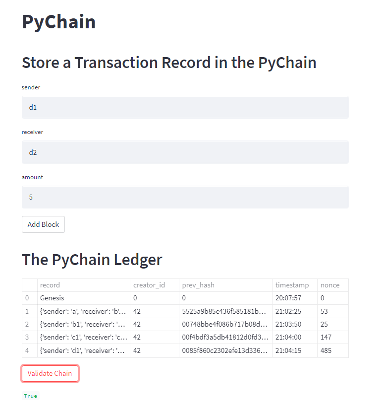
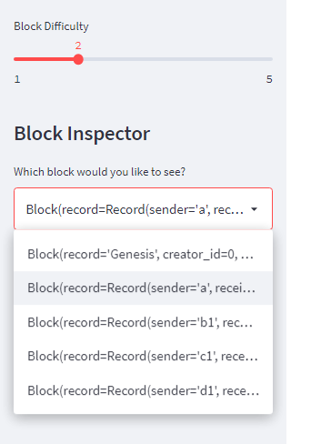
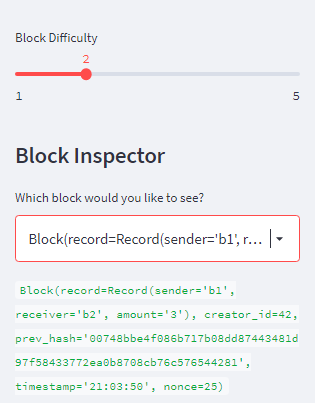

# Project Title: Blockchain

The project is a basic application to build a blockchain-based ledger system, complete with a user-friendly web interface. This ledger should allow partner banks to conduct financial transactions (that is, to transfer money between senders and receivers) and to verify the integrity of the data in the ledger.

---

## Technologies:

The project uses python 3.7 with the following packages:

* [pandas](https://pandas.pydata.org/) - For providing data analysis and manipulation tool built on top of the Python programming language

* [streamlit](https://streamlit.io/) - turns data scripts into shareable web apps

* [hashlib](https://docs.python.org/3/library/hashlib.html) - This module implements a common interface to many different secure hash and message digest algorithms

* [datclasses](https://docs.python.org/3/library/dataclasses.html) - This module provides a decorator and functions for automatically adding generated special methods to user-defined classes

* [typing](https://docs.python.org/3/library/typing.html) - This module provides runtime support for type hints

* [datetime](https://docs.python.org/3/library/datetime.html) - The datetime module supplies classes for manipulating dates and times.


---

## Installation Guide

Before running the application first install the following dependencies:

```python
import streamlit as st
from dataclasses import dataclass
from typing import Any, List
import datetime as datetime
import pandas as pd
import hashlib
```

---

## Usage

To run the program, run the Streamlit application in the terminal by using `streamlit run pychain.py

Screenshot of sample data:




---

## Contributors

Jung Kim


---

## License

MIT License
